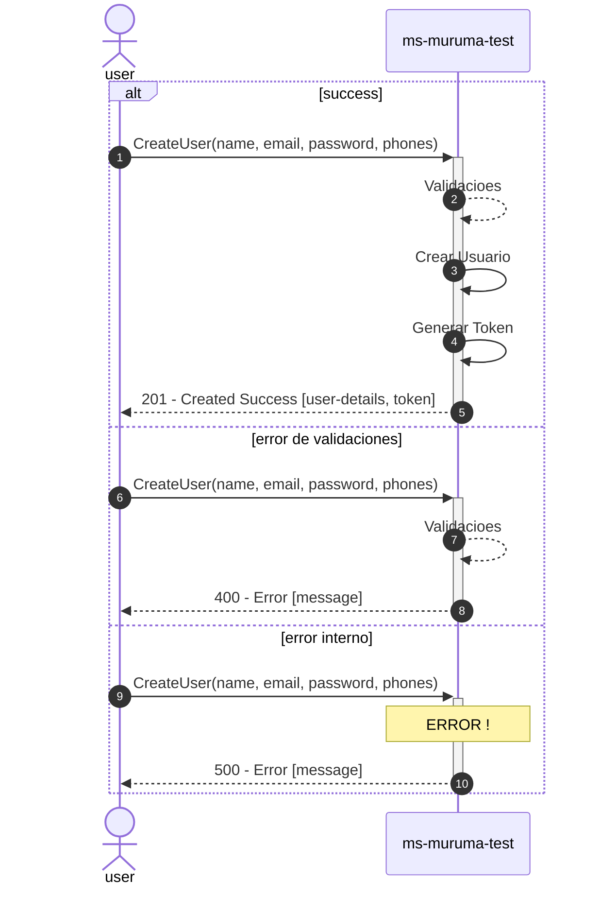

# ms-muruma-test

#### Java 11 - Gradle

API RESTful de creación de usuarios con autenticacion JWT.

### Requerimientos:
<details><summary>gradle</summary>

```
// SPING
org.spring-boot-starter-web
org.spring-boot-starter-validation
org.spring-boot-starter-data-jpa

io.springfox:springfox-boot-starter:3.0.0
io.springfox:springfox-swagger2:3.0.0
io.springfox:springfox-swagger-ui:3.0.0
javax.validation:validation-api:2.0.1.Final

// Logstash
net.logstash.logback:logstash-logback-encoder:6.3

// JWT
io.jsonwebtoken:jjwt-api:0.12.3
io.jsonwebtoken:jjwt-impl:0.12.3
io.jsonwebtoken:jjwt-jackson:0.12.3

//TEST
spring-boot-starter-test
org.springframework.boot:spring-boot-starter-test
com.tngtech.archunit:archunit-junit5:1.1.0
com.tngtech.archunit:archunit:1.0.0
```
</details>

### Repositorio:

[GITHUB: ms-muruma-test](https://github.com/samuel363/ms-muruma-test)

### Endpoints:

- LOGIN: [POST]
    - /api/v1/login
- CREATE: [POST]
    - /api/v1/user/create
- READ: [GET]
    - /api/v1/user/{id}
- UPDATE: [PUT]
    - /api/v1/user/{id}
- DELETE: [DELETE]
    - /api/v1/user/{id}

- **[TODO: Phone CRUD]**

#### Swagger:

Para mas detalle consultar la
**[Documentacion Swagger](http://localhost:8080/swagger-ui/index.html#/user-controller-adapter)**

## Recursos:

### SQL:
para arrancar posicionarse en la carpeta docker y ejecutar el siguiente comando:
```shell
docker-compose up -d
```

<details><summary>init.sql [POSTGRES]</summary>

```sql
CREATE EXTENSION IF NOT EXISTS "uuid-ossp";

CREATE TABLE IF NOT EXISTS "user"(
    id UUID PRIMARY KEY DEFAULT uuid_generate_v4(),
    name VARCHAR(100) not null,
    email VARCHAR(100) UNIQUE not null,
    password VARCHAR(100) not null,
    created timestamp not null DEFAULT now(),
    modified timestamp not null DEFAULT now(),
    last_login timestamp not null DEFAULT now(),
    token text,
    is_active boolean not null
);

CREATE TABLE IF NOT EXISTS phone(
    id UUID PRIMARY KEY DEFAULT uuid_generate_v4(),
    number INT not null,
    city_code VARCHAR(100) not null,
    country_code VARCHAR(100) not null,
    user_id UUID,
    CONSTRAINT fk_user FOREIGN KEY(user_id) REFERENCES "user"(id) ON DELETE CASCADE
);

COMMIT;
```

</details>

## Diagrama de Solucion:

### Crear Usuario:



## Gracias por todo ! ...


[Muruma Team](https://muruna.cl)
